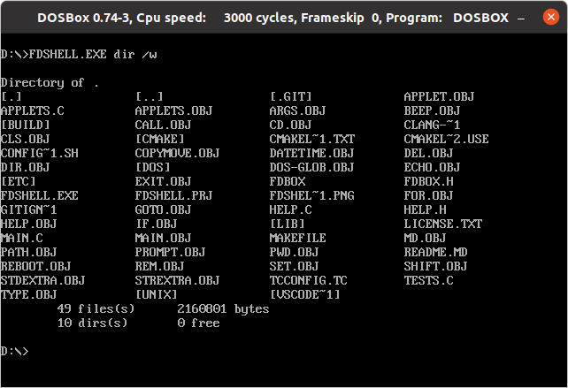
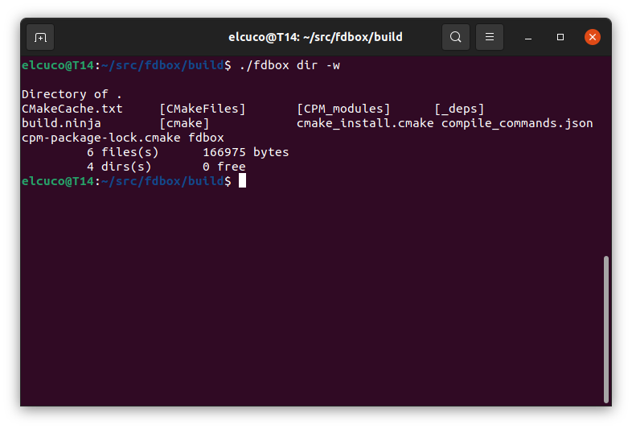
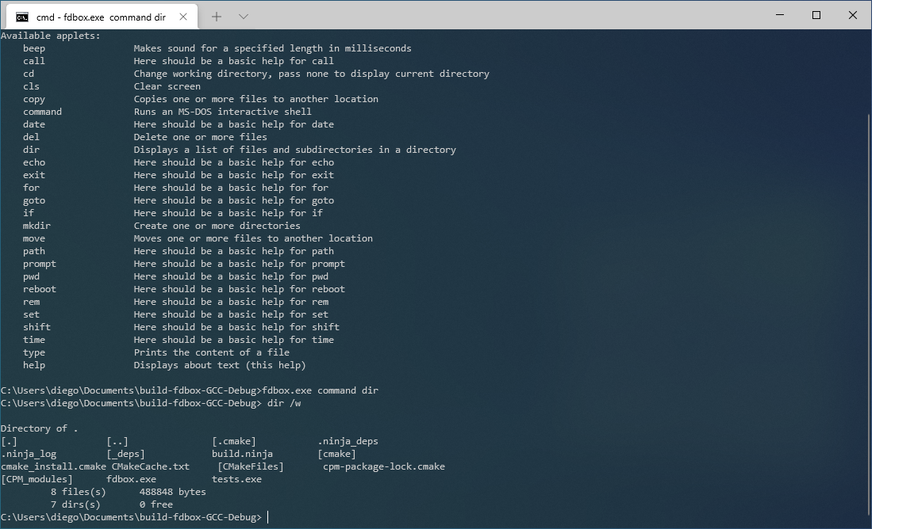
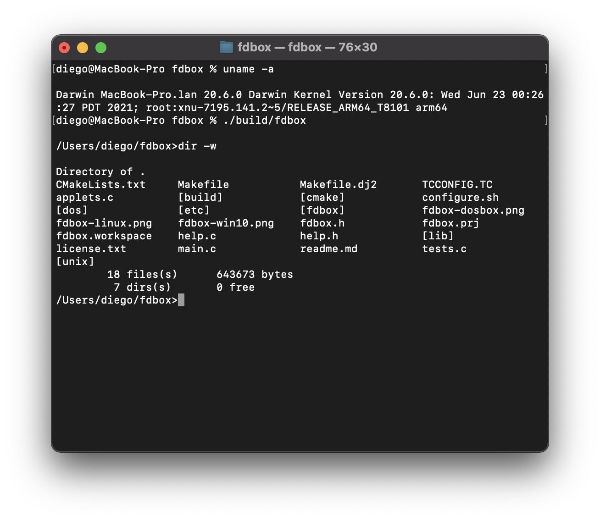

# fdbox

A new command interpreter for FreeDOS. Code will contain usable utilities
borrowed from Unix and maintain (basic) compatibility with 
MSDOS 6.22 `command.com`, while (sometimes) improving. 

[](https://github.com/elcuco/fdbox/actions/workflows/build.yml) 


<p align="center">

</p>

The program compiles also as a native Linux executable
<p align="center">

</p>

.. and Windows as well 
<p align="center">

</p>

.. and Apple silicon as well 
<p align="center">

</p>

Yes this code compiles on DOS 8086 16bit, Windows 8086 32bit and Linux amd64 and OSX64/ARM!. I see no reasons why should it fail
to compile on other platforms/OS.

## Status

 * Only DOS commands are supported. Unix commands might follow.
 * Code compiles using clang/GCC (Windows+Linux+OSX), TCC (DOS), OpenWatcom2/snapshot (DOS).   
 * Github actions compiles all the code for Linux, Windows, MSDOS and OSX, 
   the worlflow also runs the test on all platforms. (tests do not run on MSDOS yet).
 * Currently code uses LibC's functions - so it is limited to
   standard C code support for localization.
 * All commands support multiple arguments (like Unix shells), unlike DOS
   which you cannot do `del /r file1.txt *.bat /f`, and arguments can come
   even after file names (not only at the begining of the command).
 * Some commands share the same code (`copy`+`move`, `date`+`time`)
 * Interactive shell is beeing worked on. I want to have 4DOS command  
   completion, or bash/zsh. 
 * Contains a bash shell script to generate the development enviroment
   for DOS+DosBOX

See also: 

 * [coding.md](coding.md)
 * [building.md](building.md)
 * [readme.txt](readme.txt)

## TODO
* Command (main interactive shell) does not support batch files. See https://github.com/elcuco/fdbox/tree/batch-files-support branch.
* Command does not support redirection
* Command does not support "|"
* Command does not support executing external commands
* `TurboC` does need a proper makefile.
* Make OW build a Windows binary (as well)
* OW build is done by using gnu-make and not ow-make
* Setup CI/CD to compile a DJGPP cross compilation
* Setup CI/CD to run dosemu in console mode, and compile using TC
* Setup CI/CD to run dosemu in console mode, and run tests
* History is not saved/read.
* I had this `configure` system which would create the sources for commands
   and auto generate the `applets.c` file. Not against the idea.
* There are commands that are available on Unix and DOS, but differ 
   in syntax  unsure how to handle.
* MSDOS: Using XMS swapping wold be good, using SPWNO would be epic (http://www.cs.cmu.edu/%7Eralf/files.html)
* Platform specific APIs (`&` on Windows/Linux to run a program in 
  background for example).
* On Linux we can print escape sequences to make files on `dir`
  be clickable. 
* see also implementation tables bellow

## Implementation status of commands
| command               | status  | remark                                                                                                                                                                                              |
|-----------------------|---------|-----------------------------------------------------------------------------------------------------------------------------------------------------------------------------------------------------|
| `beep`                | *done*  | needs to be tested on DOS/Windows, on unix it just beeps                                                                                                                                            |
| `call`                | not yet |                                                                                                                                                                                                     |
| `cd`                  | *done*  |                                                                                                                                                                                                     |
| `cls`                 | *done*  |                                                                                                                                                                                                     |
| `copy`                | WIP     | All copies are binaries. By design. <br> Recursive copy not implemented yet <br> Copy globs, and several files - not implemented yet <br> Append files (copy file1+file2 file3) not implemented yet |
| `command`             | WIP     | See bellow                                                                                                                                                                                          |
| `date`/`time`         | WIP     | Missing AM/PM support <br> Not supported on windows (only DOS/Linux)                                                                                                                                |
| `del`                 | *done*  | Prompt might need more testing                                                                                                                                                                      |
| `dir`                 | WIP     | `/o?` order is funky. <br> `/p` - pausing is not implemented <br> Missing disk usage                                                                                                                |
| `echo`                | *done*  |                                                                                                                                                                                                     |
| `if`                  | *done*  |                                                                                                                                                                                                     |
| `for`                 | not yet |                                                                                                                                                                                                     |
| `md`/`mkdir`          | *done*  |                                                                                                                                                                                                     |
| `move`/`rename`/`ren` | *done*  | All thes command are aliases, hardcoded                                                                                                                                                             |
| `prompt`              | *done*  | internal library issues                                                                                                                                                                             |
| `rem`                 | *done*  |                                                                                                                                                                                                     |
| `set`                 | *done*  |                                                                                                                                                                                                     |
| `type`                | *done*  | Bonus: support also line numbers printing                                                                                                                                                           |
| `type`                | *done*  | As a bonus, can also print line numbers                                                                                                                                                             |
| `ver`                 | *done*  |                                                                                                                                                                                                     |

Major project worked on is interactive shell. The main task right now is the 
internal readline code (history, editor etc).

## Command line editor status:
| Key                    | status  | remark                                |
|------------------------|---------|---------------------------------------|
| Left/right/home/end    | *done*  |                                       |
 | Up/Down: history       | WIP     | fails randomly                        |
 | Backspace              | *done*  |                                       |
 | Del                    | not yet |                                       |
 | control+a : HOME       | *done*  |                                       |
 | control+b : word left  | not yet |                                       |
 | control+c : cancel     | WIP     | de facto - clear line, fails on Posix |
 | control+d : EOF        | *done*  |                                       |
 | control+e : END        | *done*  |                                       |
 | control+f : word right | not yet |                                       |
 | control+l : cls        | *done*  |                                       |
 | TAB                    | not yet |                                       |
 | insert/override        | done    | Cursor shape not supported on OXS     |
 | esc                    | ????    | Fix breaks on Linux/OSX ?             |          
 | insert                 | *done*  | Toggle insert/override mode           |
 | control+arrors         | not yet | move to next/prev word                |

## Compiler support
 1. Linux: Clang/GCC - this is the main development environment. Supported.
 2. Windows10: MinGW/TCM (9,10) - this is the main development environment. Supported.
 3. DOS: TC 2.02 - this is the main development environment. Supported.
    > __BUG__:
    >
    > `glob()` functionlaity tends to allocate too much >memory, and the code is faulty,
          not reporting this to the app. Results in garbage in the screen when
	  > `dir ` on a directory with lots of files (~80 on my tests, but it depends
	  > on memory available).
 4. DOS/OpenWatcoom (WIP): we have a CI building it. The generated binary crashes on startup.
 5. OSX: Works (similar code path as Linux)
 6. DOS: DJGPP - I am having problems in runtime. Seems like `tolower()` is breaking
    my code. Might be a compiler bug. Interactive shell segfaults.
 7. DOS: PacificC - Its not a high priority, but we have a working branch called `pacific-c-support`
    which contains the work needed to make this project compile with that compiler.

## Why?
Because.

I started this project at 2001, and only recently re-started it from scratch. The idea came
after I saw Minibox, and though (as every programmer does...) "this is wrong, this is not the
way to do this, I will do it better". I am unsure if I am doing it better, but this is the
best way to thank Ercan Ersoy - you give me a push to restart this project: thank you.

My old project:
http://dgi_il.tripod.com/fds/index.html

Minibox:
https://github.com/ercanersoy/Minibox

Ideas and inspiration do come from busybox (the applet concept for
example). However - this project does not share any code, and cannot
be considered a derived work (please don't copy code from Busybox here,
as I might re-license code, and want new implementations for those old ideas).

## DosBox setup

I created a Linux shell script which will populate a "C:" drive for development.
Just execute it, and it will download all the compilers, and create an AUTOEXEC.BAT.

Then in DosBox config, edited the start up files (usually at the end) to this:


    mount c /home/diego/fdbox/etc/dosbox
    mount d /home/diego/fdbox/
    C:\AUTOEXEC.BAT
    d:

Then, each time I start dosbox, I have in the path all the compilers I need and
I am redirected to the full code of the program in drive D:. The project contains
a TurboC project file - so typing `tc` will bring up the IDE with the project ready
to hack.

Linux requirements:
```
apt install 7z wget dosbox
```

OSX requirements:
```
brew install p7zip wget dosbox
```

TODO: If you save a file under DOS, DosBox will rename it to capital letters. I am
unsure how to automatically do this.

## License
GPL V3. See file license.txt
